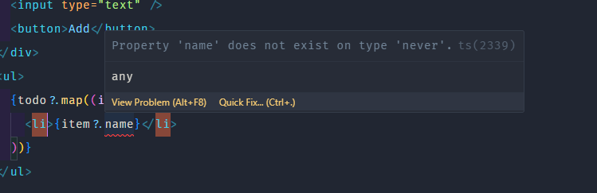

## Type

- When using useState with an object as its value, we need to declare its data type.
  

```tsx
const [todo, setTodo] = useState<{ id: string; name: string }[]>([]);
```

- We declare the data type for useState as follows:

```tsx
useState<data type>(initial value)
```

- In the example above, `todo` is an array of objects with two fields, `id` and `name`, which are both strings.
- Additionally, we can create a separate type for the data.

```tsx
type TodoType = {
  id: string;
  name: string;
};
const [todo, setTodo] = useState<TodoType[]>([]);
```

- It's recommended to use **interface** to declare the data type for an object.

```tsx
interface Person {
  name: string;
  age: number;
}
```

### Declaring types for component props

```tsx
const Todo = ({ name }: { name: string }) => {
  return <li>{name}</li>;
};
```

#### 1.1 With multiple values in props, we create a separate type.

```tsx
type Props = {
  inputValue: string;
  handleChangeInput: (e: ChangeEvent<HTMLInputElement>) => void;
  handleAddTodo: () => void;
};
const Todo = ({ inputValue, handleChangeInput, handleAddTodo }: Props) => {
  return (
    <div>
      <input type="text" value={inputValue} onChange={handleChangeInput} />
      <button onClick={handleAddTodo}>Add</button>
    </div>
  );
};
```

- Since the handleChangeInput function does not return anything, we use **void**, and it receives an event when the input changes, so we use **ChangeEvent<HTMLInputElement>**.

#### 1.2 When props receive a value from state with a declared data type, we need to export the type to use it.

```tsx
const TodoList = ({ todo }: { todo: TodoType[] }) => {
  return (
    <ul>
      {todo?.map((item) => (
        <Todo key={item?.id} name={item?.name} />
      ))}
    </ul>
  );
};
```

### Type for event when listening for a change event

```tsx
const handleChange = (e: React.ChangeEvent<HTMLInputElement>) => {
  console.log(e.target.value);
};
```

### Type for function declared with useState

```tsx
const Count = ({ count, setCount }: { count: number; setCount: React.Dispatch<React.SetStateAction<number>> }) => {
  return (
    <div>
       onClick={() => setCount(count + 1)}>Increase</button>
    </div>
  );
};
```

- `React.Dispatch<React.SetStateAction<number>>` is the data type for the setCount function.

### Type for regular functions

- If a function returns a value

```tsx
const add = (a: number, b: number): number => {
  return a + b.
};
```

### Combining types with common fields

- Use **&** to combine types with common fields.

```tsx
type Person = {
  name: string;
  age: number.
};

type Employee = Person & {
  salary: number.
};
```

- To combine two interfaces with common fields, we use **extends**.

```tsx
interface Person {
  name: string.
  age: number.
}
interface Employee extends Person {
  salary: number.
}
```
### Union type
- Use **|** to indicate that a value can be either A or B.

```tsx
boolean | undefined.
```

## Enum

- To ensure a variable only accepts specific values, we use **enum**.

```tsx
enum Color {
  Red,
  Green,
  Blue,
}

type Car = {
  color: Color.
};
```

- When declaring an enum, its values are assigned in order starting from 0, 1, 2.
- To get the value of an enum, we use **Color.Red**, **Color.Green**, **Color.Blue**.
- To change the value of an enum, we assign a value to it.

```tsx
enum Color {
  Red = "red",
  Green = "green",
  Blue = "blue",
}
```

## Keyword typeof
- Use **typeof** to get the data type of a variable or an object.

```tsx
type Person = {
  name: string.
  age: number.
};
const person: Person = {
  name: "John",
  age: 30,
};
type PersonType = typeof person.
```

## Generic type
- For example, we have two responses. Response A returns data with id and name, and Response B returns data with id and BookName. However, both responses have the same structure with data and status. If another response is returned, we have to declare a new type, which is not optimal. We can use generic types to reuse the data type.

- It is a data type that can accept another data type.

```tsx
type Response<T> = {
  data: T.
  status: number.
};
const response: Response<{id:number, name: string}> = {
  data: {id: 1, name: "John"},
  status: 200,
};
const response2: Response<{id:number, BookName: string}> = {
  data: {id: 1, BookName: "React"},
  status: 200,
};
```


# ⚠Note:

- There are two ways to declare data types for useState: **type**, **interface**.
- In the case where the initial value is a simple value such as string, number, or boolean, there is no need to declare a data type. For complex values, we use **type**.

```tsx
const [name, setName] = useState("").
```

- We can use **?:** to indicate that a value may or may not be present.

```tsx
type ToDo = {
  isCompleted?: boolean.
}
```
