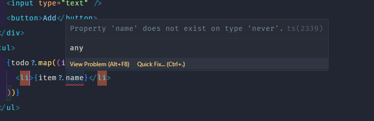

## Type

- Khi dùng useState mà giá trị của nó là 1 object thì ta cần phải khai báo kiểu dữ liệu cho nó
  

```tsx
const [todo, setTodo] = useState<{ id: string; name: string }[]>([]);
```

- Ta khai báo kiểu dữ liệu cho useState như sau:

```tsx
useState<kiểu dữ liệu>(giá trị khởi tạo)
```

- Trong trường hợp trên, todo là 1 mảng object có 2 trường id và name là string
- Ngoài ra ta có thể viết kiểu dữ liệu ra 1 type riêng

```tsx
type TodoType = {
  id: string;
  name: string;
};
const [todo, setTodo] = useState<TodoType[]>([]);
```

- Nên dùng **interface** để khai báo kiểu dữ liệu cho object

```tsx
interface Person {
  name: string;
  age: number;
}
```

### Khai báo type cho props components

```tsx
const Todo = ({ name }: { name: string }) => {
  return <li>{name}</li>;
};
```

#### 1.1 Với nhiều giá trị trong props thì ta tạo 1 type riêng

```tsx
type props = {
  inputValue: string;
  handleChangeInput: (e: ChangeEvent<HTMLInputElement>) => void;
  handleAddTodo: () => void;
};
const Todo = ({ inputValue, handleChangeInput, handleAddTodo }: props) => {
  return (
    <div>
      <input type="text" value={inputValue} onChange={handleChangeInput} />
      <button onClick={handleAddTodo}>Add</button>
    </div>
  );
};
```

- Do bên kia hàm handleChangeInput ko trả về gì nên ta dùng **void**, và hàm nhận vào 1 event khi input change nên ta dùng **ChangeEvent<HTMLInputElement>**

#### 1.2 Với việc props nhận là giá trị trong state có kiểu dữ liệu đã khai báo thì cần export type ra ngoài để dùng

```tsx
const TodoList = ({ todo }: { todo: TodoType[] }) => {
  return (
    <ul>
      {todo?.map((item) => (
        <Todo key={item?.id} name={item?.name} />
      ))}
    </ul>
  );
};
```

### Type event khi lắng nghe sự kiến change

```tsx
const handleChange = (e: React.ChangeEvent<HTMLInputElement>) => {
  console.log(e.target.value);
};
```

### Type cho fn khi khai báo với useState

```tsx
const Count = ({count, setCount} : {count: number, setCount: React.Dispatch<React.SetStateAction<number>>}) => {
  return (
    <div>
       onClick={() => setCount(count + 1)}>Increase</button>
    </div>
  );
};
```

- React.Dispatch<React.SetStateAction<number>>: là kiểu dữ liệu của hàm setCount

### Type cho fn thường

- Nếu fn có trả về giá trị

```tsx
const add = (a: number, b: number): number => {
  return a + b;
};
```

### Kết hợp các type có cùng trường

- Sử dụng **&** để kết hợp các type có cùng trường

```tsx
type Person = {
  name: string;
  age: number;
};

type Employee = Person & {
  salary: number;
};
```

- Đối với việc kết hợp 2 interface có cùng trường thì ta dùng **extends**

```tsx
interface Person {
  name: string;
  age: number;
}
interface Employee extends Person {
  salary: number;
}
```
### Union type
- Dùng **|** để đánh dấu giá trị đó có thể là A hoặc B

```tsx
boolean | undefined;
```

## Enum

- Để giá trị của 1 biến chỉ nhận 1 trong các giá trị cố định thì ta dùng **enum**

```tsx
enum Color {
  Red,
  Green,
  Blue,
}

type Car = {
  color: Color;
};
```

- Khi khai báo enum thì giá trị của nó sẽ được gán theo thứ tự từ 0, 1, 2
- Khi lấy giá trị của enum thì ta dùng **Color.Red**, **Color.Green**, **Color.Blue**
- Nếu muốn thay đổi giá trị của enum thì ta gán giá trị cho nó

```tsx
enum Color {
  Red = "red",
  Green = "green",
  Blue = "blue",
}
```

## Keyword typeof
- Dùng **typeof** để lấy kiểu dữ liệu của 1 biến, 1 object

```tsx
type Person = {
  name: string;
  age: number;
};
const person: Person = {
  name: "John",
  age: 30,
};
type PersonType = typeof person;
```

## Generic type
- Ví dụ ta có 2 response. Response A trả về data là id và name, Response B trả về data là id và BookName. Tuy nhiên cả 2 response đều có cấu trúc giống nhau là data và status. Nếu có response khác trả về ta lại phải khai báo 1 type mới thì không tối ưu. Ta có thể dùng generic type để tái sử dụng type dữ liệu

- Là type dữ liệu có thể nhận vào 1 kiểu dữ liệu khác

```tsx
type Response<T> = {
  data: T;
  status: number;
};
const response: Response<{id:number, name: string}> = {
  data: {id: 1, name: "John"},
  status: 200,
};
const response2: Response<{id:number, BookName: string}> = {
  data: {id: 1, BookName: "React"},
  status: 200,
};
```


# ⚠Note:

- Có 2 kiểu khai báo kiểu dữ liệu cho useState:**type**, **interface**
- Trong trường hợp giá trị khởi tạo là 1 giá trị đơn giản như string, number, boolean thì không cần khai báo kiểu dữ liệu. Với những giá trị phức tạp thì mới cần **type**

```tsx
const [name, setName] = useState("");
```

- Ta có thể dùng **?:** để đánh dấu giá trị đó có thể có hoặc không

```tsx
type ToDo = {
  isCompleted?: boolean;
}
```


